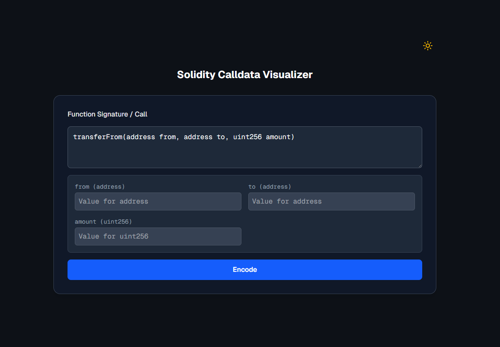

# Solidity Calldata Visualizer


*Please replace `screenshot.png` with a screenshot of your application.*

Solidity Calldata Visualizer is an interactive web-based tool designed to help Ethereum developers understand the ABI encoding mechanism of Solidity function calls. It provides a clear, step-by-step view that details how a function signature and its arguments are converted into the final hexadecimal calldata sent to a smart contract.

This tool is invaluable for learning and debugging Solidity ABI encoding and understanding how data is laid out in the EVM.

## ✨ Core Features

- **Real-time ABI Encoding**: Dynamically generates input fields for arguments based on the entered function signature and encodes the calldata in real-time.
- **Detailed Calldata Breakdown**: Decomposes the generated calldata into several key parts:
  - **Function Selector**: Displays the 4-byte hash of the function signature.
  - **Head Section**: Shows the encoded values of all static types (e.g., `uint256`, `address`) and the offsets pointing to the data location for all dynamic types (e.g., `string`, `bytes`, `address[]`).
  - **Tail Section**: Displays the actual encoded data for all dynamic types, including their length and content.
- **Broad Data Type Support**:
  - **Static Types**: `uintN`/`intN`, `address`, `bool`, `bytesN`
  - **Dynamic Types**: `string`, `bytes`
  - **Array Types**: Supports arrays of all static types, such as `address[]`, `uint256[]` (via comma-separated input).
  - **Structs**: Supports both static and dynamic nested structs.
- **Precise Padding Display**:
  - Correctly left-pads (MSB padding) types that are less than 32 bytes, such as `uint128` or `address`.
  - Correctly right-pads (LSB padding) `bytesN` types.
  - Right-pads the data of `string` and `bytes` to align to a 32-byte multiple.
- **Clean and Intuitive UI**:
  - Uses an indented flat list to clearly represent the hierarchy and nesting of data.
  - Supports both light and dark theme modes.

## 🛠️ Tech Stack

- **Framework**: [Next.js](https://nextjs.org/) (React)
- **Language**: [TypeScript](https://www.typescriptlang.org/)
- **Core Logic**: [viem](https://viem.sh/) - Used for core ABI encoding, parsing, and cryptographic operations.
- **Styling**: [Tailwind CSS](https://tailwindcss.com/)
- **Package Manager**: [pnpm](https://pnpm.io/)

## 🚀 Getting Started

Follow these steps to set up and run the project in your local environment.

### Prerequisites

- [Node.js](https://nodejs.org/) (v18.x or later)
- [pnpm](https://pnpm.io/installation) (Recommended to install globally with `npm install -g pnpm`)

### Installation & Running

1.  **Clone the repository**
    ```bash
    git clone <YOUR_REPOSITORY_URL>
    cd solidity-calldata-visualization
    ```

2.  **Install dependencies**
    ```bash
    pnpm install
    ```

3.  **Run the development server**
    ```bash
    pnpm dev
    ```

4.  **Access the application**
    Open [http://localhost:3000](http://localhost:3000) in your browser to see the application.

## 📖 How to Use

1.  **Enter Function Signature**: In the "Function Signature / Call" input box, enter the full function signature you want to visualize. For example: `myFunction(address to, uint256 amount, string message, bytes16 data)`.
2.  **Fill in Argument Values**: The application will automatically generate the corresponding input fields for the arguments.
3.  **Input Arrays**: For array-type parameters (e.g., `address[]`), use **commas** to separate each element in the input field. For example: `0x..., 0x..., 0x...`.
4.  **Click "Encode"**: Click the button to generate and view the calldata breakdown.
5.  **Analyze the Result**: Observe the "Encoded Calldata" and "Breakdown" sections to understand every detail of the encoding.

## 📄 License

This project is licensed under the MIT License. See the `LICENSE` file for details.
